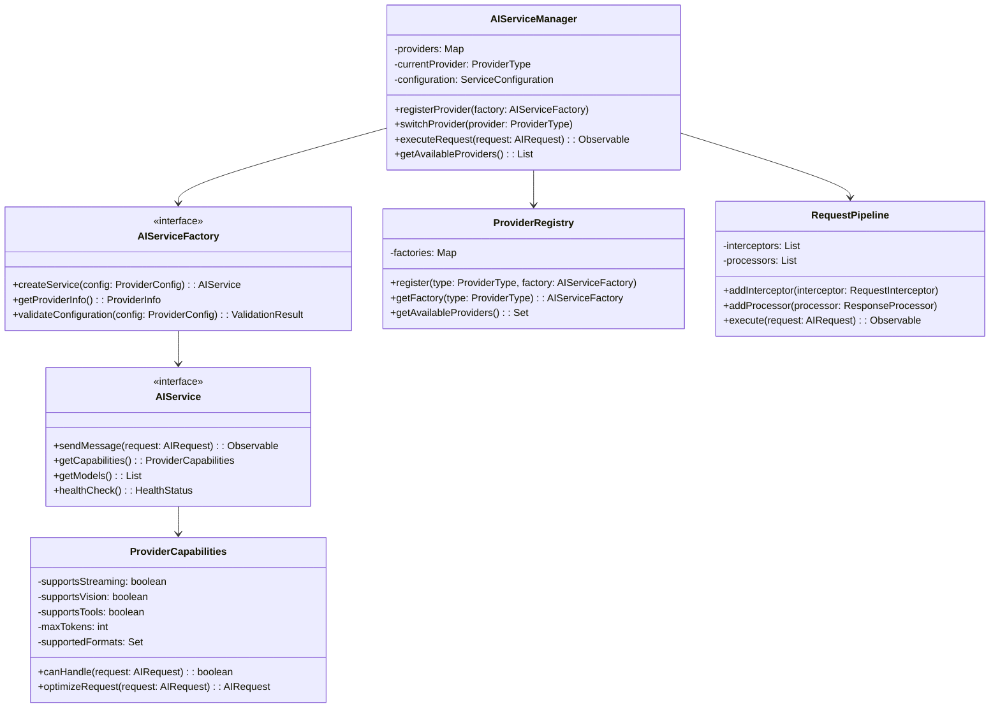
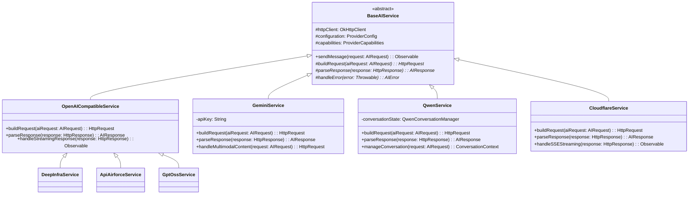
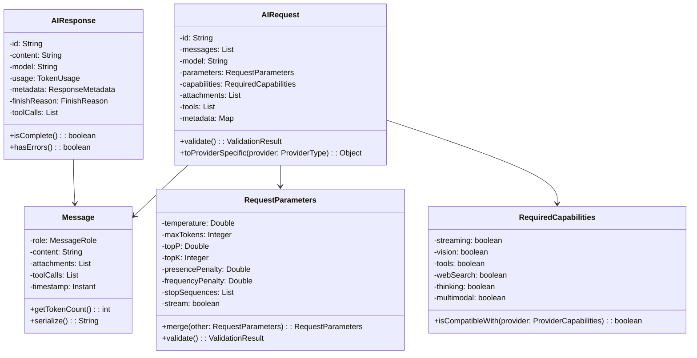
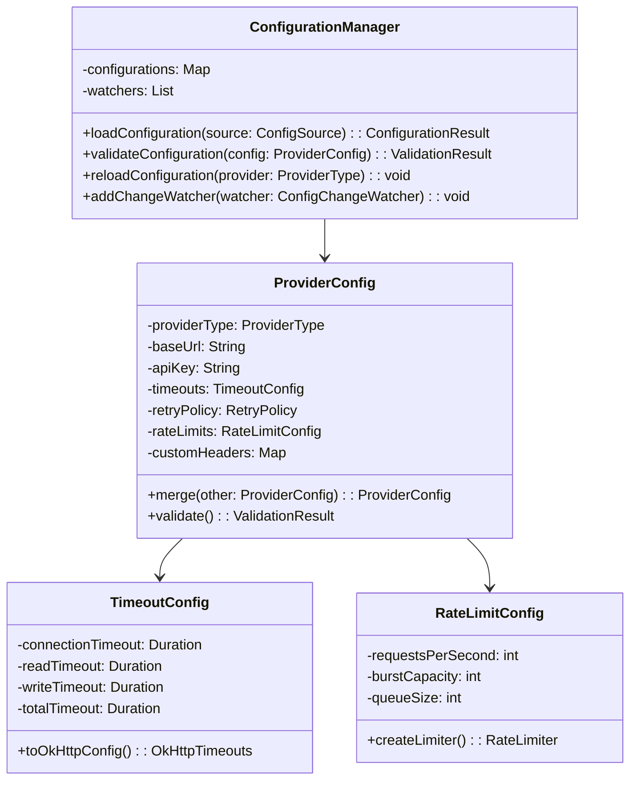
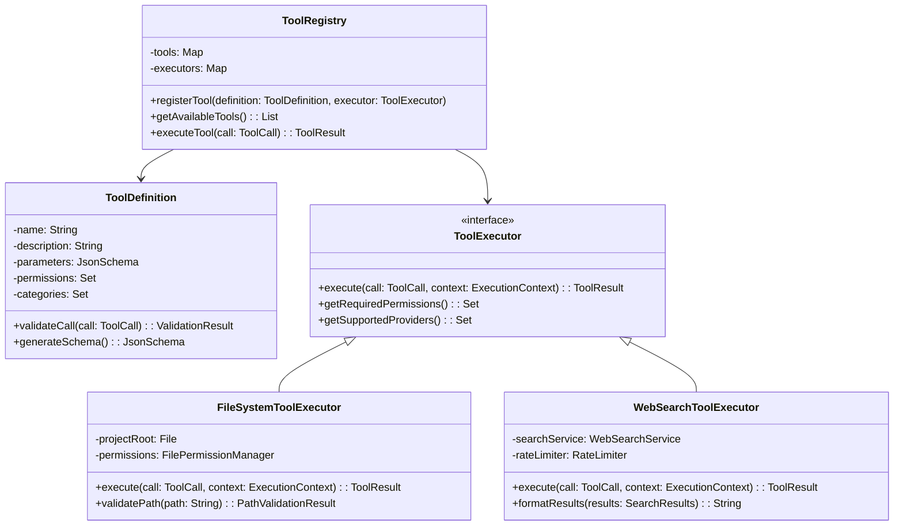
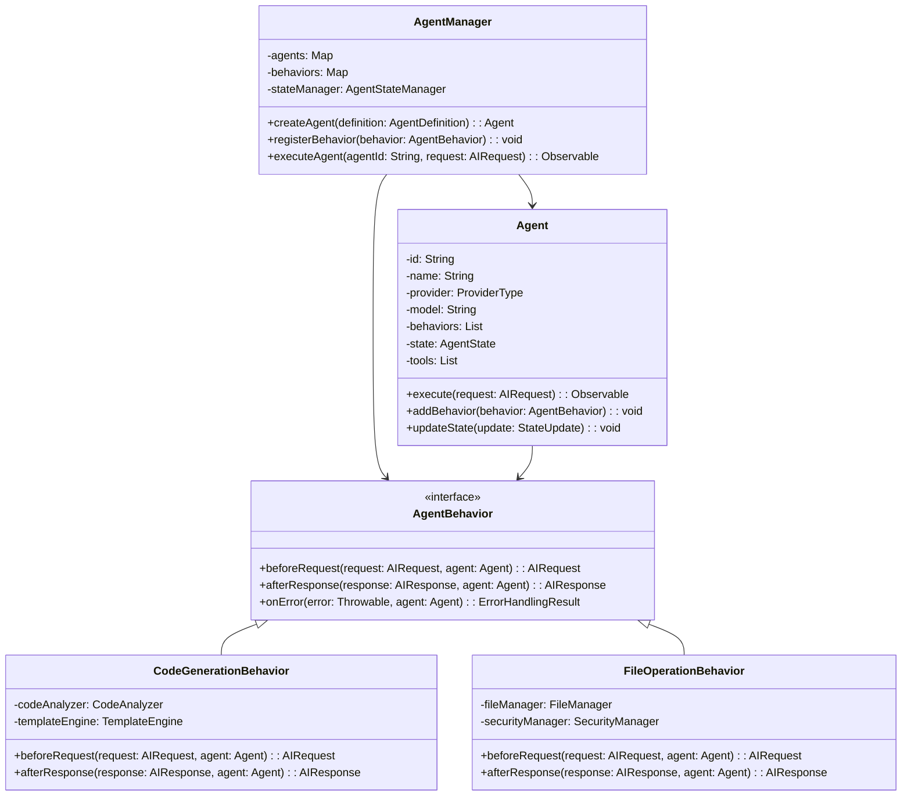
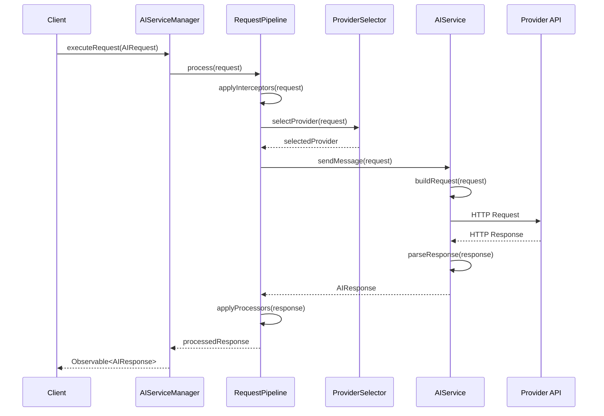

# Modular API Client Architecture Design

## Overview

This design outlines the refactoring of CodeX's AI integration system from a provider-specific, tightly-coupled architecture to a modular, production-grade, provider-agnostic unified system. The refactoring transforms the current collection of individual API clients into a cohesive, extensible framework that supports multiple AI providers while maintaining consistent interfaces, robust error handling, and enterprise-grade reliability.

**Current Pain Points:**
- Provider-specific implementations scattered across multiple classes
- Tight coupling between UI components and specific API clients
- Inconsistent error handling and response parsing
- Duplicate code across similar provider implementations
- Difficulty adding new providers or modifying existing ones
- No standardized capability negotiation
- Limited support for advanced features like streaming, tools, and multimodal inputs

**Target Architecture Goals:**
- Universal provider interface with consistent capabilities
- Pluggable provider system with dependency injection
- Standardized request/response pipeline with middleware support
- Type-safe configuration and capability management
- Production-grade error handling, retry logic, and circuit breaking
- Comprehensive logging, metrics, and monitoring
- Thread-safe concurrent operations with resource management

## Technology Stack & Dependencies

**Core Framework:**
- Java 8+ with Android SDK
- Retrofit 2.x for HTTP client abstraction
- OkHttp 4.x for connection pooling and interceptors
- Gson for JSON serialization/deserialization
- RxJava 3.x for reactive programming and async operations

**Design Patterns:**
- Factory Pattern for provider instantiation
- Strategy Pattern for provider-specific implementations
- Observer Pattern for streaming responses
- Builder Pattern for configuration objects
- Adapter Pattern for protocol translation

**Quality Assurance:**
- JUnit 5 for unit testing
- Mockito for mocking dependencies
- Espresso for integration testing
- SonarQube for code quality analysis

## Architecture

### Core Architecture Overview



### Provider Implementation Architecture



### Request/Response Data Models



## Component Architecture

### 1. Service Layer Components

#### AIServiceManager (Orchestrator)
Central coordinator that manages provider lifecycle and request routing.

**Responsibilities:**
- Provider registration and discovery
- Request routing to appropriate providers
- Fallback provider selection
- Load balancing across multiple instances
- Circuit breaker pattern implementation
- Metrics collection and monitoring

**Key Methods:**
```java
public class AIServiceManager {
    public Observable<AIResponse> executeRequest(AIRequest request) {
        return selectProvider(request)
            .flatMap(provider -> pipeline.execute(request, provider))
            .retryWhen(retryPolicy)
            .timeout(configuration.getRequestTimeout())
            .onErrorResumeNext(this::handleFallback);
    }
    
    public void registerProvider(ProviderType type, AIServiceFactory factory) {
        registry.register(type, factory);
        healthMonitor.monitor(type);
    }
    
    public ProviderSelectionResult selectProvider(AIRequest request) {
        return providerSelector.selectOptimal(request, getAvailableProviders());
    }
}
```

#### BaseAIService (Abstract Provider)
Template method pattern implementation providing common functionality.

**Responsibilities:**
- HTTP client management with connection pooling
- Request/response serialization framework
- Error handling and retry logic
- Streaming response management
- Rate limiting and throttling

**Template Methods:**
```java
public abstract class BaseAIService implements AIService {
    protected abstract HttpRequest buildRequest(AIRequest request) throws RequestBuildException;
    protected abstract AIResponse parseResponse(HttpResponse response) throws ParseException;
    protected abstract Observable<AIResponse> handleStreaming(HttpResponse response);
    
    public final Observable<AIResponse> sendMessage(AIRequest request) {
        return Observable.fromCallable(() -> buildRequest(request))
            .flatMap(this::executeHttpRequest)
            .flatMap(response -> request.isStreaming() ? 
                handleStreaming(response) : 
                Observable.just(parseResponse(response)))
            .doOnError(this::logError)
            .onErrorResumeNext(this::mapToAIError);
    }
}
```

### 2. Configuration Management

#### ProviderConfiguration System
Type-safe configuration management with validation and hot-reload capabilities.



### 3. Tool Integration Framework

#### Universal Tool System
Provider-agnostic tool specification and execution framework.



### 4. Agent System Redesign

#### Modular Agent Architecture
Composable agent system with behavior injection and state management.



## Data Models & Schema

### Core Request/Response Types

```java
// Universal request model
public class AIRequest {
    private String id;
    private List<Message> messages;
    private String model;
    private RequestParameters parameters;
    private RequiredCapabilities requiredCapabilities;
    private List<Attachment> attachments;
    private List<ToolSpec> tools;
    private Map<String, Object> metadata;
    private ExecutionContext context;
    
    // Builder pattern for construction
    public static class Builder {
        public Builder withMessages(List<Message> messages) { /* */ }
        public Builder withModel(String model) { /* */ }
        public Builder withParameters(RequestParameters parameters) { /* */ }
        public Builder requireCapabilities(RequiredCapabilities capabilities) { /* */ }
        public Builder withAttachments(List<Attachment> attachments) { /* */ }
        public Builder withTools(List<ToolSpec> tools) { /* */ }
        public AIRequest build() throws ValidationException { /* */ }
    }
}

// Universal response model
public class AIResponse {
    private String id;
    private String content;
    private String model;
    private TokenUsage usage;
    private ResponseMetadata metadata;
    private FinishReason finishReason;
    private List<ToolCall> toolCalls;
    private List<Citation> citations;
    private Optional<ThinkingContent> thinking;
    
    public boolean isComplete() { return finishReason != FinishReason.INCOMPLETE; }
    public boolean hasToolCalls() { return !toolCalls.isEmpty(); }
    public boolean hasErrors() { return metadata.hasErrors(); }
}

// Provider capabilities definition
public class ProviderCapabilities {
    private boolean supportsStreaming;
    private boolean supportsVision;
    private boolean supportsTools;
    private boolean supportsThinking;
    private boolean supportsWebSearch;
    private boolean supportsMultimodal;
    private int maxTokens;
    private int maxAttachments;
    private Set<String> supportedFormats;
    private Set<ToolCategory> supportedToolCategories;
    
    public boolean canHandle(AIRequest request) {
        return request.getRequiredCapabilities().isCompatibleWith(this);
    }
    
    public AIRequest optimizeRequest(AIRequest request) {
        // Provider-specific request optimization
        return request.adaptTo(this);
    }
}
```

### Configuration Schema

```java
// Type-safe configuration
@JsonDeserialize(builder = ProviderConfig.Builder.class)
public class ProviderConfig {
    private final ProviderType providerType;
    private final String baseUrl;
    private final String apiKey;
    private final TimeoutConfig timeouts;
    private final RetryPolicy retryPolicy;
    private final RateLimitConfig rateLimits;
    private final Map<String, String> customHeaders;
    private final HealthCheckConfig healthCheck;
    
    // Immutable builder pattern
    public static class Builder {
        public Builder providerType(ProviderType type) { /* */ }
        public Builder baseUrl(String url) { /* */ }
        public Builder apiKey(String key) { /* */ }
        public Builder timeouts(TimeoutConfig timeouts) { /* */ }
        public Builder retryPolicy(RetryPolicy policy) { /* */ }
        public Builder rateLimits(RateLimitConfig limits) { /* */ }
        public ProviderConfig build() throws ConfigurationException { /* */ }
    }
    
    public ValidationResult validate() {
        // Comprehensive validation logic
        return ValidationResult.builder()
            .validateUrl(baseUrl)
            .validateApiKey(apiKey)
            .validateTimeouts(timeouts)
            .build();
    }
}
```

## Business Logic Layer

### Request Processing Pipeline



### Provider Selection Strategy

```java
public class ProviderSelector {
    private final List<SelectionCriteria> criteria;
    private final HealthMonitor healthMonitor;
    private final LoadBalancer loadBalancer;
    
    public ProviderSelectionResult selectOptimal(AIRequest request, 
                                               List<ProviderInfo> availableProviders) {
        return availableProviders.stream()
            .filter(provider -> isCompatible(provider, request))
            .filter(provider -> healthMonitor.isHealthy(provider.getType()))
            .map(provider -> scoreProvider(provider, request))
            .max(Comparator.comparing(ScoredProvider::getScore))
            .map(scored -> ProviderSelectionResult.success(scored.getProvider()))
            .orElse(ProviderSelectionResult.noSuitableProvider());
    }
    
    private boolean isCompatible(ProviderInfo provider, AIRequest request) {
        return provider.getCapabilities().canHandle(request) &&
               provider.getModels().contains(request.getModel());
    }
    
    private ScoredProvider scoreProvider(ProviderInfo provider, AIRequest request) {
        double score = 0.0;
        
        // Capability matching score
        score += calculateCapabilityScore(provider.getCapabilities(), request);
        
        // Performance score (latency, success rate)
        score += calculatePerformanceScore(provider.getType());
        
        // Cost score (if cost-aware selection is enabled)
        score += calculateCostScore(provider.getType(), request);
        
        // Load balancing score
        score += loadBalancer.getLoadScore(provider.getType());
        
        return new ScoredProvider(provider, score);
    }
}
```

### Error Handling & Resilience

```java
public class ResilientExecutor {
    private final CircuitBreaker circuitBreaker;
    private final RetryPolicy retryPolicy;
    private final BulkheadPolicy bulkheadPolicy;
    private final TimeoutPolicy timeoutPolicy;
    
    public <T> Observable<T> execute(Supplier<Observable<T>> operation, 
                                   ProviderType provider) {
        return Observable.defer(operation)
            .compose(circuitBreaker.toObservableTransformer())
            .compose(bulkheadPolicy.toObservableTransformer())
            .compose(timeoutPolicy.toObservableTransformer())
            .retryWhen(retryPolicy.toRetryFunction())
            .doOnError(error -> recordFailure(provider, error))
            .doOnNext(result -> recordSuccess(provider));
    }
    
    private void recordFailure(ProviderType provider, Throwable error) {
        metrics.incrementCounter("provider.failures", 
            Tags.of("provider", provider.name(), "error", error.getClass().getSimpleName()));
        healthMonitor.recordFailure(provider, error);
    }
    
    private void recordSuccess(ProviderType provider) {
        metrics.incrementCounter("provider.successes", 
            Tags.of("provider", provider.name()));
        healthMonitor.recordSuccess(provider);
    }
}
```

## Testing Strategy

### Unit Testing Framework

```java
@ExtendWith(MockitoExtension.class)
class AIServiceManagerTest {
    @Mock private ProviderRegistry providerRegistry;
    @Mock private RequestPipeline pipeline;
    @Mock private HealthMonitor healthMonitor;
    
    @InjectMocks private AIServiceManager serviceManager;
    
    @Test
    @DisplayName("Should route request to healthy provider with matching capabilities")
    void shouldRouteToHealthyCompatibleProvider() {
        // Given
        AIRequest request = AIRequest.builder()
            .withMessages(List.of(new Message("user", "Hello")))
            .requireCapabilities(RequiredCapabilities.streaming())
            .build();
        
        ProviderInfo geminiProvider = ProviderInfo.builder()
            .type(GOOGLE)
            .capabilities(ProviderCapabilities.withStreaming())
            .build();
        
        when(providerRegistry.getAvailableProviders())
            .thenReturn(List.of(geminiProvider));
        when(healthMonitor.isHealthy(GOOGLE))
            .thenReturn(true);
        when(pipeline.execute(request, geminiProvider))
            .thenReturn(Observable.just(AIResponse.success("Hello!")));
        
        // When
        TestObserver<AIResponse> observer = serviceManager
            .executeRequest(request)
            .test();
        
        // Then
        observer.awaitDone(5, TimeUnit.SECONDS)
            .assertComplete()
            .assertValueCount(1)
            .assertValue(response -> "Hello!".equals(response.getContent()));
    }
    
    @Test
    @DisplayName("Should fallback to secondary provider when primary fails")
    void shouldFallbackWhenPrimaryProviderFails() {
        // Implementation for fallback testing
    }
}
```

### Integration Testing

```java
@SpringBootTest(webEnvironment = RANDOM_PORT)
@TestPropertySource(properties = {
    "ai.providers.google.enabled=true",
    "ai.providers.google.apiKey=test-key",
    "ai.providers.openai.enabled=false"
})
class AIServiceIntegrationTest {
    @Autowired private AIServiceManager serviceManager;
    @MockBean private ExternalApiClient externalApiClient;
    
    @Test
    @DisplayName("Should handle end-to-end request processing with real provider")
    void shouldProcessRequestEndToEnd() {
        // Given
        mockExternalApiResponse();
        AIRequest request = createTestRequest();
        
        // When
        AIResponse response = serviceManager
            .executeRequest(request)
            .blockingSingle();
        
        // Then
        assertThat(response)
            .isNotNull()
            .satisfies(r -> {
                assertThat(r.getContent()).isNotEmpty();
                assertThat(r.isComplete()).isTrue();
                assertThat(r.hasErrors()).isFalse();
            });
    }
}
```

### Performance Testing

```java
@Component
class PerformanceTestSuite {
    private final AIServiceManager serviceManager;
    private final MeterRegistry meterRegistry;
    
    @EventListener(ApplicationReadyEvent.class)
    public void runPerformanceTests() {
        // Load testing
        runConcurrentRequestTest(100, Duration.ofMinutes(5));
        
        // Latency testing
        measureResponseLatency(1000);
        
        // Memory usage testing
        monitorMemoryUsage(Duration.ofMinutes(10));
    }
    
    private void runConcurrentRequestTest(int concurrency, Duration duration) {
        ExecutorService executor = Executors.newFixedThreadPool(concurrency);
        AtomicLong successCount = new AtomicLong();
        AtomicLong errorCount = new AtomicLong();
        
        for (int i = 0; i < concurrency; i++) {
            executor.submit(() -> {
                while (!Thread.currentThread().isInterrupted()) {
                    try {
                        serviceManager.executeRequest(createTestRequest())
                            .blockingSingle();
                        successCount.incrementAndGet();
                    } catch (Exception e) {
                        errorCount.incrementAndGet();
                    }
                }
            });
        }
        
        // Record metrics
        Timer.Sample sample = Timer.start(meterRegistry);
        sample.stop(Timer.builder("performance.test.duration")
            .tag("type", "concurrent")
            .register(meterRegistry));
    }
}
```